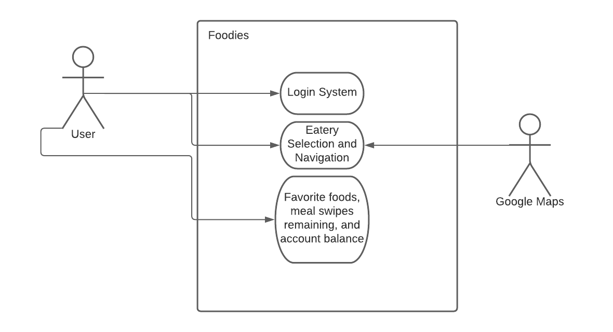

# Foodies

## Project Abstract
Foodies is an application that displays dining halls, cafés, coffee shops, food trucks, and restaurants in and around Temple. Students will be empowered to make informed choices about their next meal by having a plethora of information at the disposal of their fingertips. Available on Apple and Android, Foodies will provide congestion of the eatery that you’re visiting, display the amount of swipes you have remaining for the week as well as the remaining balance, and an option to favorite your preferred items. 

## Project Relevance
This proposal is related to the learning goals of the course because when designing such an application, object-oriented design, test-driven development, and a graphical user interface are amongst the various strategies we will use to create the application. These goals are vital to the career progression of a software engineer because it requires the collaborative effort of multiple people to create a successful, breathable, and functional program that others can use. TDD allows us to resolve the defects in our code to deliver new functionality. OOD allows us to reduce development time and increase reusability. 

## Conceptual Design
With my skills in Photoshop and experience in android application development, I will be able to design and help implement some of the functionalities of the application. My ambition to learn Swift and willingness to work with others will support us in the endeavor of having a multi-platform application that works on a broad range of devices.

## Background
_A URL reference to the project. Add text on how to build and run succesfully._ 

<https://github.com/HeapifyMe/FoodiesProposal>

***Building***

**Running**

## Required Resources
- _Swift or Android Studio_
- _Ambitious developers_
